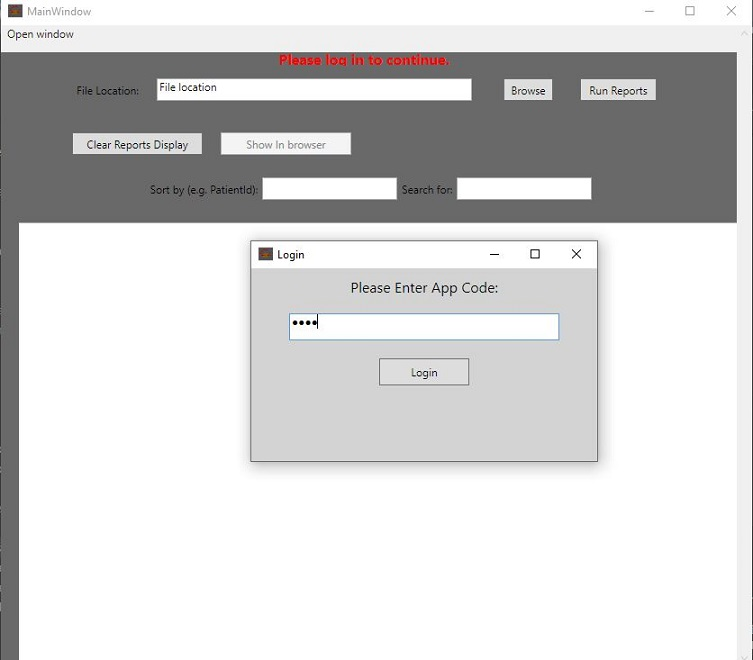
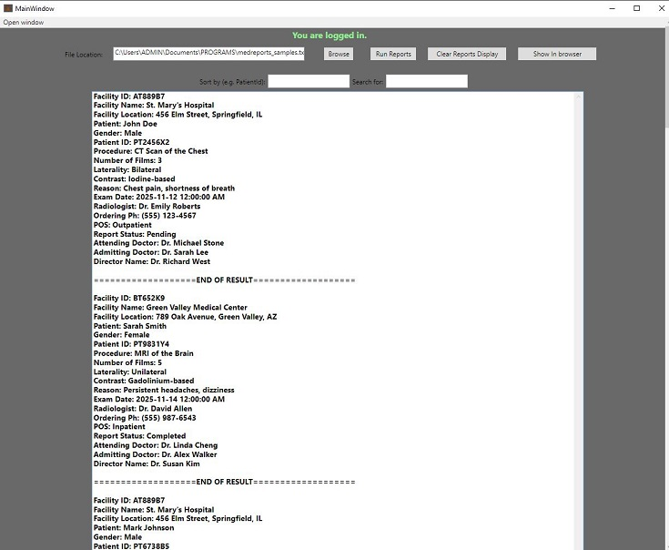
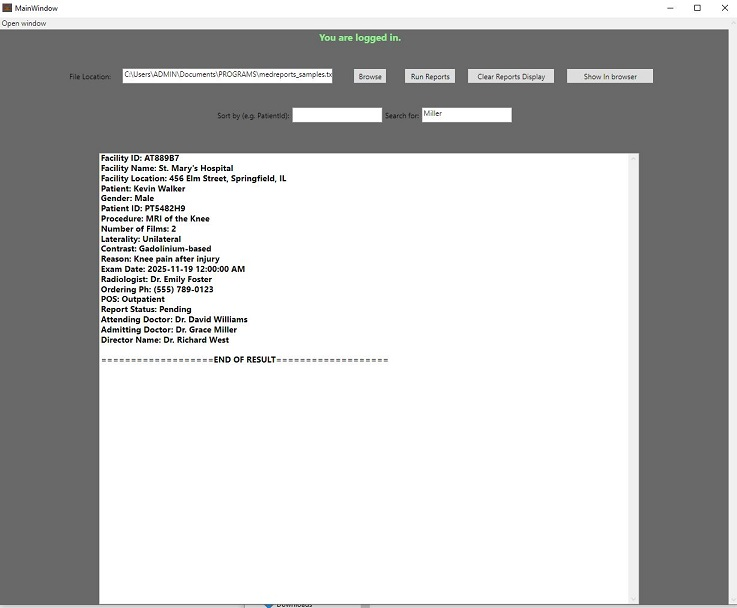
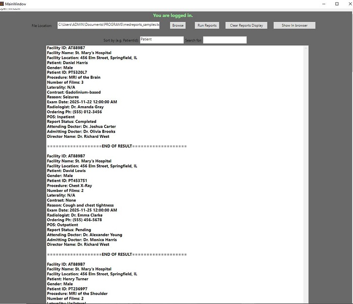
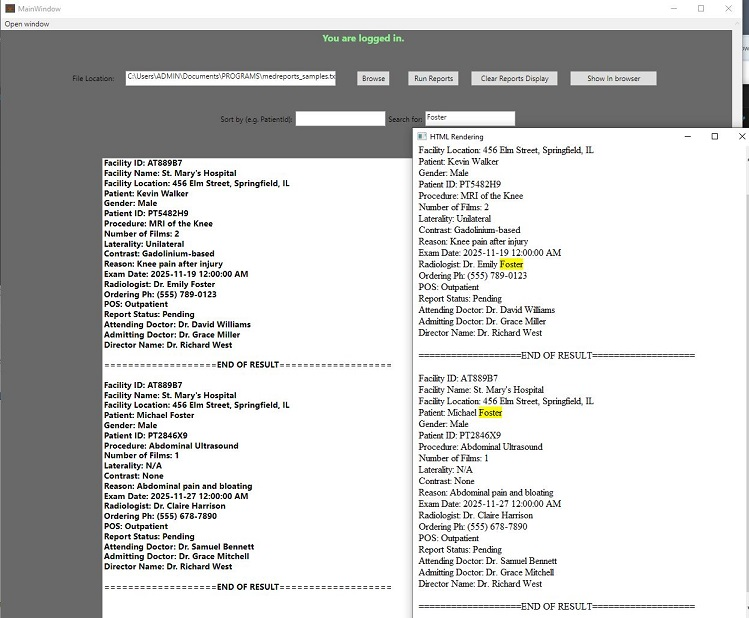
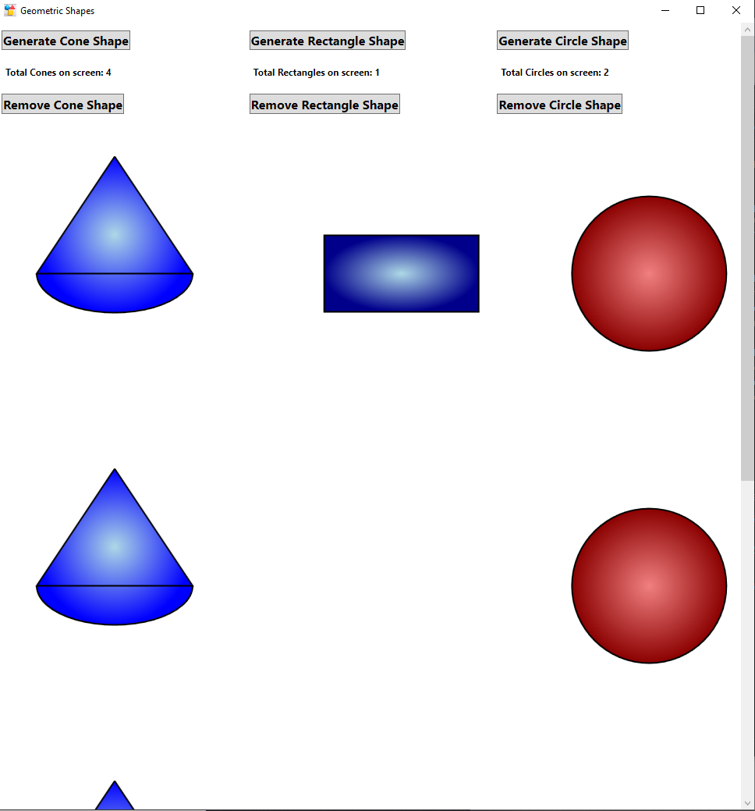

# Overview

This repository contains three Visual Studio projects, each serving different purposes. The solutions are:

1. FileParserApp: Contains a class library project (FileParseApi) and its corresponding (WPF) user interface project (FileParserUserInterface).
2. HostingWpfUserControlInWf: Contains a WPF application that displays geometric shapes.
3. SDiStudentApi: Contains an ASP.NET application with an Angular frontend that implements a Web API.

## Table of Contents

- [FileParserApp: Medical Record Management System](#fileparserapp-medical-record-management-system)
- [HostingWpfUserControlInWf: WPF Geometric Shapes Display](#hostingwpfusercontrolinwf-wpf-geometric-shapes-display)
- [SDiStudentApi: ASP.NET Web API with Angular](#sdistudentapi-asp.net-web-api-with-angular)
- [Getting Started](#getting-started)
- [Dependencies](#dependencies)
- [License](#license)
- [Acknowledgements](#acknowledgments)
---

## FileParserApp: Medical Record Management System

This solution consists of two projects:

### 1. **Class Library (FileParseApi)**

The class library contains medical domain logic for managing medical records. It provides functionalities to:

- **Read and Parse a Medical Records File**: Parses a file that contains medical records.
- **Output Parsed Records**: Outputs and returns the parsed file contents in a structured format via provided method call.
- **Search for Specific Text in All Records**: Searches for a particular text across all medical records.
- **Search by Metadata (e.g., PatientId)**: Allows the user to search for records by specific metadata such as `PatientId`.
- **Sort by Record Metadata (e.g., FacilityId)**: Sorts the records based on various metadata, such as `FacilityId`.

### 2. **WPF User Interface (FileParserUserInterface)**

This is the user interface project that interacts with the class library. It provides a graphical interface where users can:

- Load a file of medical records.
- Search for specific text across all records and display results in user interface.
- Perform searches based on metadata such as `PatientId`.
- View the parsed medical records and their metadata in a structured format.
- Sort the records by various attributes (e.g., `FacilityId`).
- View results in a browser interface (for compatibility with web-based tools) while hightlighing search fields.

The UI project calls the methods from the class library to execute the aforementioned actions.

## Disclaimer

**Note:** The images and data shown in this repository are produced from randomly generated data for demonstration purposes. They do not represent real persons or actual events. Any resemblance is purely coincidental.


## Screenshots

Here are some screenshots showing key features of the application:

### 1. **Login Screen**
This is the initial screen where users can log into the application:



### 2. **Main Dashboard**
After logging in, users can view the main dashboard, where medical records are displayed in a table format.



### 3. **Search Functionality**
Users can search for specific records by patient ID or facility ID. Here’s how the search results are shown:




### 4. **Sort Functionality**
Users can sort medical records by metadata field e.g. patient ID or facility ID. Here’s how the sort results are shown:




### 5. **View Results in Browser interface (with highlighting)**
Users can view results in a browser interface while hightlighing search or 'sortby' fields. Here’s how the sort results are shown:




---

## HostingWpfUserControlInWf: WPF Geometric Shapes Display

This solution contains a WPF application that displays one or more geometric shapes in a grid. It includes the following features:

- **UserControls for Geometric Shapes**: UserControls define various geometric shapes (e.g., circles, rectangles, polygons).
- **Grid Display**: These shapes are displayed in a grid layout in the `MainWindow.xaml`.
- **Dynamic Shape Generation**: The number and types of shapes to be displayed can be dynamically generated based on user input.



This solution demonstrates basic WPF usage, user controls, and layout management.

---

## SDiStudentApi: ASP.NET Web API with Angular

This solution includes an ASP.NET application using the Angular library to create a Web API application. It includes:

- **ASP.NET Core Web API**: Provides the backend API for handling requests and managing data stored in in-memory repository.
- **Angular Frontend**: The Angular application handles frontend interactions and communicates with the Web API. It fetches data from the API and displays it in the user interface.

The Web API serves as a backend to support various client-side operations, and Angular provides an interactive and dynamic frontend.

---

## Getting Started

To get started with these solutions, follow the steps below:

### 1. **Clone the repository**:
   ```bash
   git clone https://github.com/rknow/work-samples.git
   cd work-samples
```

### 2. **Open projects in Visual Studio**
- Launch Visual Studio.
- Select File > Open > Project/Solution.
- Navigate to the respective each project:

### 3. **Build the projects in this order to ensure referenced dlls are generated**
- HostingWpfUserControlInWf
- FileParseApi
- FileParserUserInterface
- SDiStudentApi

### 4. **Run the Applications**
- Launch the WPF application (UI) to interact with the medical records.
- Launch the WPF application to see the geometric shapes displayed in the grid.
- Launch the ASP.NET Core Web API and run the Angular application using ng serve (make sure to install dependencies via npm install in the client folder).

## Dependencies

FileParserApp
- .NET Framework 4.8 or later
- WPF

HostingWpfUserControlInWf
- .NET Core 3.1 or later
- WPF

SDiStudentApi
- .NET 5.0 or later (for ASP.NET Core Web API)
- Angular (requires Node.js and npm)

## License
The source code in this repository is licensed under the MIT License.

## Acknowledgments

- WPF for creating rich desktop applications.
- ASP.NET Core for backend API development.
- Angular for building modern frontend applications.